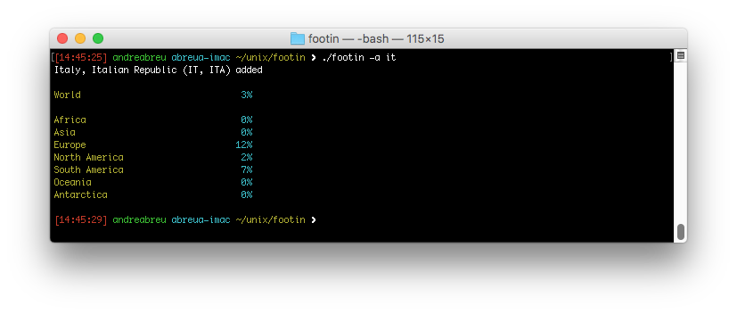
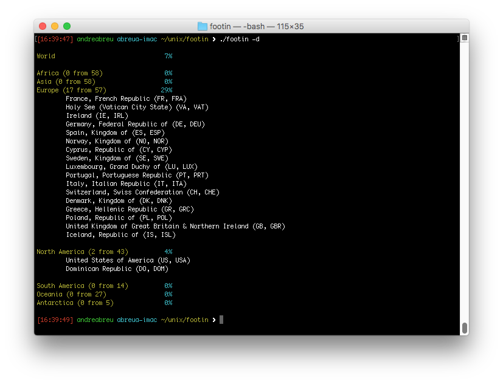

# footin 

An application to keep track of countries that you have visited. The application visualizes the visited countries both as a list, along with a ratio for each continent, and as a world map displaying the output in the UNIX terminal.




Dependencies
------------

* [GNU dbm][gdbm] 

[gdbm]: http://www.gnu.org.ua/software/gdbm/ 

Features
--------

* Cross platform (tested on x86, ARM)
* Small code footprint

Tested Environments
-------------------

* Free BSD
* GNU Linux
* MacOSX
* Raspberry Pi

If you have successfully tested this application on others systems or platforms please let me know!

Install
-------

To clone the repository you should have Git installed. Just run:

	$ git clone https://github.com/asabreu/footin

To build the application, run `make`.

If build was successful, you should get a `footin` binary.

#### Installation of development packages for `gdbm`

**macOS X with `Homebrew`:**

```
bash
    brew instal gdbm
```

**Debian & Ubuntu Linux:**

```
bash
    sudo apt-get install libgdbm-dev libgdbm3    
```

Usage
-----

The syntax is quite simple:

```
usage: footin [-d | -w | -h] [-a | -r] 'iso country code' ...

without option, display stored countries coverage list.

with option:
	-d	Display stored countries coverage with detailed list.
	-w	Wipe stored countries coverage list, the user is prompted for confirmation. 
	-h	Display this usage help.

	-a	Add country using ISO 3166-2 or ISO 3166-3 country code.
	-r	Remove country using ISO 3166-2 or ISO 3166-3 country code.
```

To-Do
-----

- [x] Wipe database option (-w)
- [x] Detailed list option (-d)
- [ ] Map visualization
- [ ] Batch load of countries

Donations
---------

 If you want to support this project, please consider donating:
 
 * PayPal: [asabreu@yahoo.com](https://www.paypal.me/asabreu)
